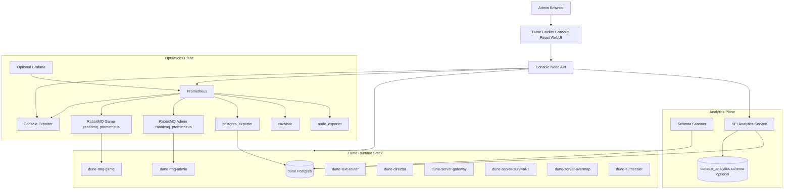
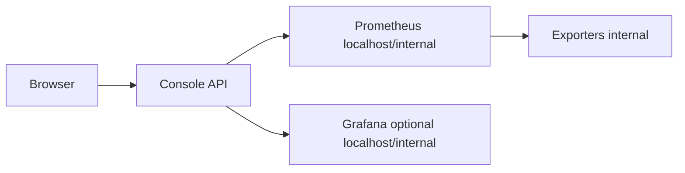
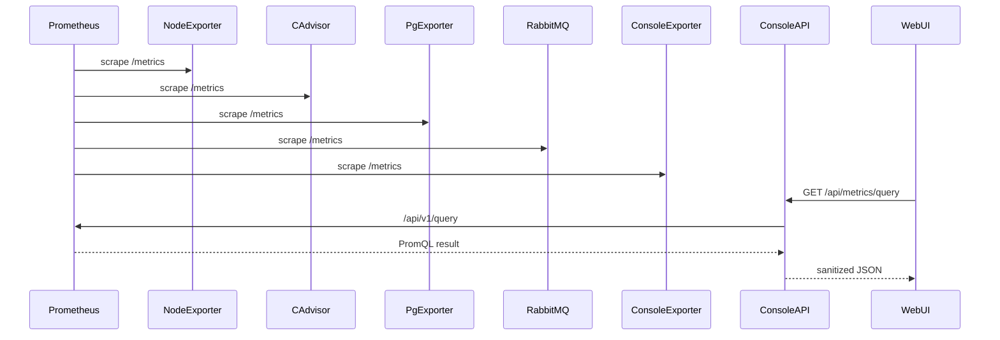
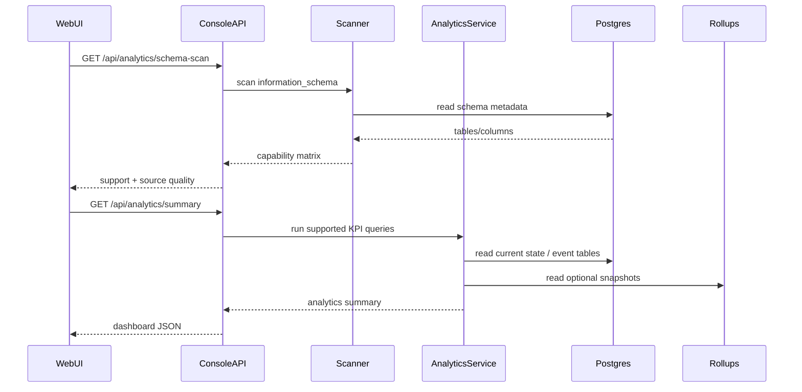
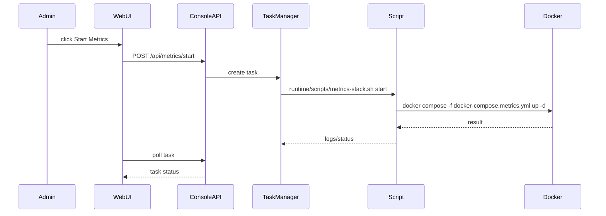

# Observability and Analytics Architecture

Branch: `feature/metrics`

## Architecture Overview

This architecture adds two planes to Dune Docker Console:

1. **Operations plane**: Prometheus-compatible infrastructure and service metrics.
2. **Analytics plane**: Dune-specific gameplay KPI analytics backed by Postgres queries and optional console-owned rollups.



## Layer Responsibilities

### Dune Runtime Stack

Existing game stack. It remains the source of truth for service state and gameplay data.

Expected core containers:

```text
dune-postgres
dune-rmq-admin
dune-rmq-game
dune-text-router
dune-director
dune-server-gateway
dune-server-survival-1
dune-server-overmap
dune-autoscaler
dune-orchestrator
redblink-dune-docker-console
```

### Operations Plane

Collects service and infrastructure health signals.

Components:

```text
Prometheus
node_exporter
cAdvisor
postgres_exporter
RabbitMQ rabbitmq_prometheus endpoints
Dune console exporter
optional Grafana
```

Responsibilities:

- collect time-series metrics;
- evaluate alert rules;
- expose target health;
- support historical infrastructure charts;
- provide low-cardinality Dune service-state gauges.

### Analytics Plane

Builds gameplay KPI insight from the Dune database.

Components:

```text
schema scanner
KPI analytics service
optional console_analytics rollup schema
Analytics WebUI
```

Responsibilities:

- discover Dune schema support;
- classify KPI source quality;
- expose read-only current analytics;
- optionally store historical snapshots/rollups;
- avoid contaminating Prometheus with high-cardinality gameplay entities.

### Console API

Becomes the authenticated control and read facade.

Responsibilities:

- serve WebUI;
- control metrics stack;
- proxy Prometheus queries safely;
- serve analytics queries;
- expose custom Prometheus metrics;
- hide exporter/Prometheus/Grafana internals from unauthenticated users.

## Deployment Topology

### Files

```text
docker-compose.metrics.yml
runtime/metrics/prometheus.yml
runtime/metrics/rules/host.yml
runtime/metrics/rules/containers.yml
runtime/metrics/rules/postgres.yml
runtime/metrics/rules/rabbitmq.yml
runtime/metrics/rules/dune-stack.yml
runtime/metrics/grafana/provisioning/datasources/prometheus.yml
runtime/metrics/grafana/provisioning/dashboards/dashboards.yml
runtime/metrics/grafana/dashboards/dune-operations.json
runtime/scripts/metrics-stack.sh
```

### Compose services

```yaml
services:
  dune-prometheus:
    image: prom/prometheus
    container_name: dune-prometheus
    restart: unless-stopped

  dune-node-exporter:
    image: quay.io/prometheus/node-exporter
    container_name: dune-node-exporter
    restart: unless-stopped

  dune-cadvisor:
    image: gcr.io/cadvisor/cadvisor
    container_name: dune-cadvisor
    restart: unless-stopped

  dune-postgres-exporter:
    image: quay.io/prometheuscommunity/postgres-exporter
    container_name: dune-postgres-exporter
    restart: unless-stopped

  dune-grafana:
    image: grafana/grafana
    container_name: dune-grafana
    restart: unless-stopped
    profiles: ["grafana"]
```

Exact image names/tags should be pinned during implementation.

## Network Architecture

### Default stance

- Prometheus: internal or localhost only.
- Grafana: optional, localhost only by default.
- Exporters: not internet exposed.
- Console: existing admin UI exposure model.
- Browser: talks only to Console API for metrics and analytics.



### RabbitMQ networking

RabbitMQ already runs two containers:

```text
dune-rmq-admin
dune-rmq-game
```

`runtime/scripts/start-rabbitmq.sh` enables the `rabbitmq_prometheus` plugin. Prometheus should scrape port `15692` inside the Docker network or via localhost-only published ports.

Default scrape mode should be aggregated `/metrics`, not per-object metrics.

### Postgres networking

Postgres is available to the host on `127.0.0.1:15432`. The postgres exporter should connect internally using a dedicated monitoring user if possible.

Do not expose the exporter externally.

## Data Flow: Operations



## Data Flow: Analytics



## Control Flow: Metrics Stack



## Component Details

### Prometheus

Role:

- scrape operational metrics;
- store time-series data;
- evaluate alert rules;
- provide query API for WebUI and Grafana.

Default retention:

```text
--storage.tsdb.retention.time=7d
--storage.tsdb.retention.size=2GB
```

### node_exporter

Role:

- host CPU;
- memory;
- filesystem;
- disk I/O;
- load;
- network;
- kernel/process pressure where available.

Containerized host monitoring should use host/rootfs mounts carefully.

### cAdvisor

Role:

- per-container CPU;
- per-container memory;
- per-container network;
- per-container filesystem;
- container start/last seen.

Scope:

- Dune containers;
- console container;
- optionally all containers visible to Docker.

### postgres_exporter

Role:

- `pg_up`;
- active connections;
- max connection usage;
- database size;
- transaction rates;
- rollbacks;
- cache hit ratio;
- temp files;
- deadlocks;
- locks;
- checkpoint/WAL stats where available.

Credentials:

- dedicated low-privilege role preferred;
- password file/secret preferred;
- no Git-tracked credentials.

### RabbitMQ prometheus plugin

Role:

- broker health;
- connections;
- channels;
- consumers;
- queues;
- ready/unacked messages;
- message rates;
- memory;
- file descriptors;
- Erlang runtime queue.

Default:

- scrape aggregated `/metrics`.
- avoid `/metrics/per-object` unless explicitly enabled for troubleshooting.

### Dune console exporter

Role:

- expose Dune-specific stack state not available from generic exporters.

Inputs:

- existing runtime scripts;
- Docker API/CLI;
- lightweight Postgres reads;
- task manager state;
- API route instrumentation.

Outputs:

- Prometheus text exposition.

### Metrics WebUI

Role:

- provide curated operator dashboard;
- avoid requiring Grafana;
- proxy Prometheus queries through authenticated API.

Pages:

```text
Overview
Host
Containers
Postgres
RabbitMQ
Dune Services
Alerts
Targets
```

### Analytics service

Role:

- discover schema;
- classify support;
- execute safe read-only KPI queries;
- optionally manage console-owned rollups.

## Security Boundaries

### Auth boundary

The browser should authenticate only to Console API. It should not need direct Prometheus, Grafana, exporter, RabbitMQ, or Postgres access.

### Network boundary

Exporters are internal. Prometheus and Grafana are internal/localhost by default. External users should not reach them directly.

### Data boundary

Prometheus receives only low-cardinality, non-sensitive metrics. Gameplay analytics stay in Postgres/API responses.

### Schema boundary

The game-owned `dune` schema is read-only for analytics. Optional persisted analytics write only to `console_analytics`.

## Label Cardinality Policy

Allowed Prometheus labels:

```text
service
container
map
state
route
method
status
protocol
port
task
job
instance
```

Disallowed Prometheus labels:

```text
player_id
character_name
account_id
funcom_id
item_id
resource_id
victim_id
killer_id
coordinates
raw_error
file_path
command_text
raw_sql
```

Reason: high-cardinality labels can degrade Prometheus performance and leak sensitive/player-specific information.

## API Surface

### Metrics API

```text
GET  /api/metrics/state
GET  /api/metrics/targets
GET  /api/metrics/alerts
GET  /api/metrics/query
GET  /api/metrics/range
POST /api/metrics/start
POST /api/metrics/stop
POST /api/metrics/restart
```

### Console exporter

```text
GET /api/metrics/prometheus
```

or:

```text
GET http://127.0.0.1:9108/metrics
```

### Analytics API

```text
GET /api/analytics/schema-scan
GET /api/analytics/summary
GET /api/analytics/players
GET /api/analytics/kills
GET /api/analytics/resources
GET /api/analytics/items
GET /api/analytics/economy
GET /api/analytics/progression
GET /api/analytics/activity
GET /api/analytics/leaderboards
```

## Failure Modes

### Prometheus unavailable

WebUI shows:

```text
Metrics stack unreachable
Last known target health unavailable
Start/restart metrics stack action
```

Gameplay Analytics remains available because it does not depend on Prometheus.

### Exporter down

Prometheus target health marks the specific exporter down. Operations tab degrades only that section.

### Postgres unavailable

- postgres_exporter marks `pg_up = 0`.
- Console Analytics returns clear unavailable state.
- Metrics WebUI still shows host/container/RabbitMQ metrics.

### RabbitMQ metrics unavailable

- RabbitMQ targets down or scrape error.
- Dune service health may still show container/listener state from console exporter.

### Schema unsupported for KPI

Analytics tab shows unsupported/partial with a human-readable reason.

## Upgrade/Migration Strategy

### First install

Metrics disabled by default unless enabled by setup or Settings.

### Existing install

- `dune metrics start` creates needed metrics runtime files.
- No changes to core game startup required.
- No writes to `dune` schema.

### Rollback

- `dune metrics stop` stops metrics stack.
- Remove `docker-compose.metrics.yml` containers and metrics volumes if desired.
- Optional `console_analytics` schema can be dropped separately.

## Open Architecture Questions

1. Should Prometheus be started automatically with Dune stack after initial enablement?
2. Should Grafana be link-out only in v1, or should a reverse proxy be implemented later?
3. Should postgres_exporter use the existing `dune` role initially or require a dedicated `postgres_exporter` role?
4. Should analytics snapshots be enabled by default or opt-in?
5. Should the Metrics tab be named `Operations`, `Metrics`, or `Observability`?
6. How much historical retention is appropriate for default WSL installs?
7. Should Alertmanager be introduced, or should v1 show Prometheus alerts only inside WebUI?

## Recommended Defaults

```text
Metrics stack: opt-in
Prometheus retention: 7d / 2GB
Scrape interval: 15s
Container scrape interval: 10s
RabbitMQ scrape mode: aggregated /metrics
Grafana: disabled by default
Analytics: read-only enabled
Analytics snapshots: disabled by default
Analytics rollup retention: 30d when enabled
```

## Implementation Order

1. Metrics documentation and RFC.
2. Metrics compose stack.
3. Prometheus scrape config and alert rules.
4. Console exporter.
5. WebUI Operations tab.
6. Analytics schema scanner.
7. WebUI Analytics tab.
8. Optional analytics snapshots.
9. Optional Grafana provisioning.

## Architecture Decision Record

Use Prometheus-compatible tooling for infrastructure observability, and use Postgres-backed native analytics for gameplay KPIs. This architecture keeps each system in its proper domain: Prometheus for low-cardinality time-series operations data; Postgres for relational gameplay data; Console WebUI for authenticated user experience.
