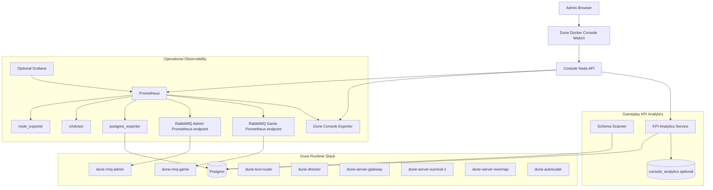

# RFC: Add Operational Observability and Gameplay KPI Analytics

## Issue Title

```text
RFC: Add Prometheus-based operational observability and native gameplay KPI analytics
```

## Summary

This RFC proposes adding two related but separate capabilities to Dune Docker Console:

1. **Operational observability** using Prometheus-compatible exporters for host, container, RabbitMQ, Postgres, WebUI/API, and Dune service health.
2. **Native gameplay KPI analytics** using read-only Postgres queries and optional console-owned rollup tables for player activity, kills/deaths, resources, items, economy, progression, guild/faction/sietch activity, and map activity.

The proposal intentionally avoids using Prometheus as the primary store for detailed gameplay analytics. Prometheus is excellent for low-cardinality infrastructure time series; Dune gameplay KPIs require relational queries, schema discovery, source-quality classification, historical snapshots, and drill-through WebUI views.

## Problem

Dune Docker Console currently provides server control, status, logs, database tools, player/admin tools, and some lightweight performance cards. However, server owners and admins need deeper visibility in two areas:

### 1. Operational health

Admins need standard operational metrics for:

- host CPU, memory, disk, filesystem, network, and load;
- Docker/container CPU, memory, network, filesystem, uptime, and missing/restarted containers;
- RabbitMQ health, connections, channels, queues, ready/unacked messages, message rates, memory, and file descriptors;
- Postgres health, connections, DB size, transactions, cache hit ratio, deadlocks, locks, temp files, and checkpoint/WAL pressure;
- Dune-specific stack readiness, listeners, game server state, autoscaler state, population/capacity, and Funcom/FLS declaration state.

### 2. Gameplay KPIs

Admins also want gameplay analytics such as:

- NPCs killed;
- players killed;
- deaths by cause;
- resources farmed;
- spice harvested;
- items crafted/looted/moved/stored;
- Solari/currency economy;
- progression/XP/specialization;
- active players by map/partition;
- guild, faction, and sietch activity;
- leaderboard-style views.

These are not the same problem and should not be forced into the same storage model.

## Goals

- Add opt-in Prometheus-backed operational metrics.
- Add standard exporters: node exporter, cAdvisor, postgres exporter, RabbitMQ Prometheus plugin, and a custom Dune console exporter.
- Add a native WebUI Operations/Metrics section.
- Keep Grafana optional for advanced users.
- Add a native WebUI Analytics/KPIs section.
- Add Dune DB schema discovery and capability reporting.
- Distinguish exact event-backed KPIs from current-state and snapshot-derived KPIs.
- Avoid writing into game-owned `dune` schema.
- Avoid high-cardinality Prometheus labels.
- Preserve secure defaults.

## Non-Goals

- Do not expose Prometheus, Grafana, exporters, RabbitMQ metrics endpoints, or Postgres exporter publicly by default.
- Do not require Grafana for the main WebUI experience.
- Do not store player IDs, character names, item IDs, victim/killer IDs, coordinates, raw errors, raw SQL, or raw command text as Prometheus labels.
- Do not claim exact gameplay event counts unless reliable event/history tables are detected.
- Do not mutate Funcom/game-owned `dune` schema for analytics.

## Proposed Architecture



## Operational Metrics Design

### Components

```text
dune-prometheus          Prometheus server / time-series storage
dune-node-exporter       host CPU, memory, disk, filesystem, network, load
dune-cadvisor            Docker/container metrics
dune-postgres-exporter   PostgreSQL metrics
dune-rmq-admin           existing broker scraped via rabbitmq_prometheus
dune-rmq-game            existing broker scraped via rabbitmq_prometheus
dune-console-exporter    custom Dune stack/service metrics
dune-grafana             optional advanced dashboard UI
```

### Scrape targets

```yaml
scrape_configs:
  - job_name: dune-node
    static_configs:
      - targets: ["dune-node-exporter:9100"]

  - job_name: dune-cadvisor
    scrape_interval: 10s
    static_configs:
      - targets: ["dune-cadvisor:8080"]

  - job_name: dune-postgres
    static_configs:
      - targets: ["dune-postgres-exporter:9187"]

  - job_name: dune-rabbitmq-admin
    static_configs:
      - targets: ["dune-rmq-admin:15692"]

  - job_name: dune-rabbitmq-game
    static_configs:
      - targets: ["dune-rmq-game:15692"]

  - job_name: dune-console
    static_configs:
      - targets: ["dune-console-exporter:9108"]
```

### Dune console exporter metrics

```text
dune_console_up
dune_console_build_info{version="..."}
dune_console_api_requests_total{method,route,status}
dune_console_api_request_duration_seconds_bucket{method,route,le}
dune_console_background_task_failures_total{task}
dune_console_active_tasks{type,status}
dune_stack_state{state="ready|warming|issue|stopped"}
dune_container_expected{container}
dune_container_running{container}
dune_listener_up{name,protocol,port}
dune_game_server_state{map,state="ready|warming|error|not_running"}
dune_population_active
dune_population_capacity
dune_world_partitions_total
dune_autoscaler_running
dune_funcom_heartbeat_ok
dune_population_declaration_ok
dune_capacity_declaration_ok
dune_gateway_db_monitoring_ok
```

### WebUI Operations section

Add a WebUI section separate from gameplay Analytics:

```text
Operations
  Overview
  Host
  Containers
  Postgres
  RabbitMQ
  Dune Services
  Alerts
  Targets
```

Suggested API routes:

```text
GET  /api/metrics/state
GET  /api/metrics/targets
GET  /api/metrics/alerts
GET  /api/metrics/query?query=<promql>
GET  /api/metrics/range?query=<promql>&start=<unix>&end=<unix>&step=<duration>
POST /api/metrics/start
POST /api/metrics/stop
POST /api/metrics/restart
```

## Gameplay KPI Analytics Design

### Why not Prometheus for detailed KPIs?

Gameplay KPI analytics are relational/event analytics, not simple infrastructure metrics. Detailed per-player/per-item/per-victim/per-resource labels would create high-cardinality Prometheus data and can leak sensitive admin/player information.

Instead, the console should query Postgres directly and optionally store rollups in a console-owned schema.

### Analytics WebUI section

```text
Analytics
  Overview
  Players
  Kills & Deaths
  Resources
  Items
  Economy
  Progression
  Guilds / Factions / Sietches
  Schema Support
```

Suggested API routes:

```text
GET /api/analytics/schema-scan
GET /api/analytics/summary
GET /api/analytics/players
GET /api/analytics/kills
GET /api/analytics/resources
GET /api/analytics/items
GET /api/analytics/economy
GET /api/analytics/progression
GET /api/analytics/activity
GET /api/analytics/leaderboards
```

### Source quality labels

Every KPI family should identify source quality:

```text
Exact        direct event/history table
Snapshot     console snapshot delta
Current      current database state only
Unsupported  no reliable source found
```

This prevents the WebUI from implying exact kill/farming counts when only current inventory or player state is available.

### Schema scanner

The scanner should inspect `information_schema.columns` and identify support for:

```text
population/activity
kills/deaths
resources/farming
items/inventory
economy/currency
progression/xp/journey
guild/faction/sietch
travel/map activity
```

Potential search terms:

```text
kill, killer, victim, death, dead, damage, combat, npc, creature, hostile
resource, harvest, gather, spice, inventory, item, stack, quantity, template_id
xp, experience, currency, solari, quest, journey, guild, sietch, faction, map, partition
```

### Optional rollup schema

If historical snapshots are enabled, use a console-owned schema:

```sql
create schema if not exists console_analytics;
```

Suggested tables:

```text
console_analytics.schema_inventory
console_analytics.kpi_snapshot_runs
console_analytics.player_daily_snapshots
console_analytics.player_resource_daily
console_analytics.player_kill_daily
console_analytics.item_daily
console_analytics.map_activity_daily
console_analytics.guild_daily
```

The game-owned `dune` schema remains read-only for analytics.

## Security and Privacy

### Secure defaults

- Metrics stack is opt-in.
- Prometheus binds internal/localhost by default.
- Grafana is disabled by default.
- Exporters are not public.
- Browser talks to Console API, not directly to Prometheus/exporters.
- Postgres exporter credentials are not stored in Git-tracked files.
- Analytics writes only to `console_analytics` if snapshots are enabled.

### Prometheus label policy

Allowed low-cardinality labels:

```text
service, container, map, state, route, method, status, protocol, port, task, job, instance
```

Disallowed high-cardinality or sensitive labels:

```text
player_id, character_name, account_id, funcom_id, item_id, resource_id, victim_id, killer_id,
coordinates, raw_error, file_path, command_text, raw_sql
```

## Suggested Files

```text
docker-compose.metrics.yml
runtime/metrics/prometheus.yml
runtime/metrics/rules/host.yml
runtime/metrics/rules/containers.yml
runtime/metrics/rules/postgres.yml
runtime/metrics/rules/rabbitmq.yml
runtime/metrics/rules/dune-stack.yml
runtime/scripts/metrics-stack.sh
console/api/src/services/metrics.js
console/api/src/services/prometheusText.js
console/api/src/services/kpiAnalytics.js
console/web/src/api/metrics.ts
console/web/src/api/analytics.ts
console/web/src/features/metrics/MetricsPanel.tsx
console/web/src/features/analytics/AnalyticsPanel.tsx
```

## Proposed Milestones

### Milestone 1: Metrics stack MVP

- Add `docker-compose.metrics.yml`.
- Add Prometheus config and retention defaults.
- Add node exporter.
- Add cAdvisor.
- Add postgres exporter.
- Scrape RabbitMQ Prometheus endpoints.
- Add `dune metrics status|start|stop|restart`.

### Milestone 2: Console exporter

- Add Prometheus text exposition helper.
- Add Dune stack/service/listener metrics.
- Add API request counters and duration histograms.
- Add task counters/duration metrics.

### Milestone 3: Operations WebUI

- Add Operations/Metrics tab.
- Show target health.
- Show host/container/Postgres/RabbitMQ/Dune service panels.
- Show Prometheus alert state.

### Milestone 4: Analytics schema scanner

- Add schema scanner endpoint.
- Add KPI capability matrix.
- Report source quality.
- Show Schema Support panel.

### Milestone 5: Analytics MVP

- Add read-only current analytics for known tables.
- Add population/activity, items, economy, progression, guild/faction views.
- Add kills/resources only when exact source tables are found; otherwise show partial/unsupported.

### Milestone 6: Analytics snapshots

- Add optional `console_analytics` schema.
- Add snapshot collection and delta calculations.
- Add retention controls.

### Milestone 7: Optional Grafana

- Add Grafana service profile.
- Provision Prometheus datasource.
- Provision operations dashboard.
- Link from WebUI when enabled.

## Default Configuration Proposal

```text
METRICS_ENABLED=0
METRICS_PROMETHEUS_PORT=9090
METRICS_GRAFANA_ENABLED=0
METRICS_GRAFANA_PORT=3000
METRICS_CONSOLE_EXPORTER_PORT=9108
METRICS_RETENTION_TIME=7d
METRICS_RETENTION_SIZE=2GB
METRICS_SCRAPE_INTERVAL=15s
METRICS_CONTAINER_SCRAPE_INTERVAL=10s
ANALYTICS_ENABLED=1
ANALYTICS_SNAPSHOT_ENABLED=0
ANALYTICS_SNAPSHOT_INTERVAL_SECONDS=900
ANALYTICS_RETENTION_DAYS=30
```

## Open Questions

1. Should the default WebUI label be `Operations`, `Metrics`, or `Observability`?
2. Should metrics start automatically once enabled, or only when explicitly started?
3. Should postgres exporter require a dedicated `postgres_exporter` user before activation?
4. Should Alertmanager be included later or should v1 show Prometheus alert state only?
5. Should Grafana be link-out only initially, avoiding iframe/reverse-proxy complexity?
6. Should analytics snapshots be opt-in even if read-only analytics are enabled by default?
7. What default retention is acceptable for small WSL installs?

## Acceptance Criteria

- Metrics stack can be started/stopped independently of the game stack.
- Prometheus targets show up/down health for node exporter, cAdvisor, Postgres exporter, RabbitMQ admin/game, and console exporter.
- WebUI displays host, container, RabbitMQ, Postgres, and Dune service metrics without requiring direct Prometheus access from the browser.
- Gameplay Analytics reports capability/source quality before showing detailed KPI panels.
- No sensitive or high-cardinality gameplay identifiers are emitted as Prometheus labels.
- Analytics does not mutate the `dune` schema.
- Grafana remains optional.

## Maintainer Notes

This proposal is intentionally modular. The operational metrics work can land independently of the gameplay analytics work. The first useful merge could be only the metrics compose stack and console exporter, followed by WebUI panels and then analytics capabilities.

The design also keeps upstream risk low: core game startup remains unchanged, metrics are opt-in, and analytics starts as read-only database inspection.
