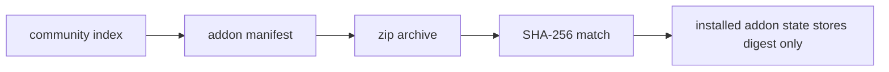
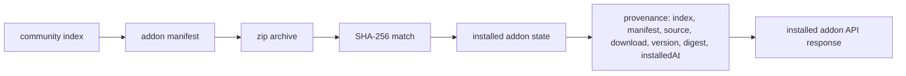

# PR 12 - Addon Provenance

Branch: `security/addon-provenance`

## Source Findings

Source: `C:/Users/ronal/OneDrive/Downloads/security_report.pdf`

- Page 11, `[DAST-M5] Community addons fetched from remote index with no code signing`: community addons are discovered from a remote index and executed after matching a SHA-256 value supplied by the same remote trust chain. A compromised index/manifest can point users at a different source, archive, and matching digest without leaving enough local audit evidence.

## Design

This change preserves the existing community addon install model while recording the provenance needed to audit what was fetched and installed.

- Adds a normalized `provenance` object for community addon summaries and installed addons.
- Records index URL, manifest URL, source URL, download URL, version, SHA-256, and install timestamp when a community addon is installed.
- Keeps the existing SHA-256 verification behavior and top-level `sha256` install response for compatibility.
- Validates provenance URLs with the existing HTTPS-only URL validator and normalizes SHA-256 values to lowercase.
- Updates the frontend API type contract without adding UI or changing addon execution behavior.

## Architecture

Before:

After:

## Evidence

Code evidence:

- `console/api/src/addons.js:42-61` enriches catalog entries with manifest-derived provenance when the index omits full details.
- `console/api/src/addons.js:79-108` returns normalized provenance for installed addons.
- `console/api/src/addons.js:177-213` persists provenance at install time alongside the existing digest and returns it in the install response.
- `console/api/src/addons.js:342-397` defines normalized provenance construction and validation.
- `console/web/src/api/addons.ts:3-53` adds the shared `AddonProvenance` type to community and installed addon API contracts.
- `console/web/src/features/addons/AddonsPanel.tsx:167-184` preserves a compatible empty provenance object for locally installed addons that are missing from the community catalog.

Test evidence:

- `console/api/test/addons.test.js:38-72` verifies catalog enrichment exposes the expected index, manifest, source, download, version, and digest provenance.
- `console/api/test/addons.test.js:124-147` verifies provenance normalization, HTTPS validation, and SHA-256 validation.
- `console/api/test/addons.test.js:165-199` verifies installed addon listing preserves stored provenance.
- `cd console/api && node --test test/addons.test.js` - 11 passing tests.
- `cd console/api && npm test` - 144 passing tests.
- `cd console/web && npm run build` - TypeScript and Vite build passed.

## Minimal Impact

- No addon install, enable, disable, bridge, or content-serving behavior changed.
- No new network calls are added; provenance reuses the already fetched index and manifest data.
- Existing persisted state remains compatible because missing provenance normalizes to an empty object.
- The existing top-level install response `sha256` is retained for clients that already depend on it.

## Follow-Ups

- Add detached signature or signed catalog support for community addons in a separate PR so provenance becomes enforceable trust metadata rather than audit metadata.
- Consider surfacing provenance in the UI before install so operators can inspect source and archive origins before approving addon permissions.
