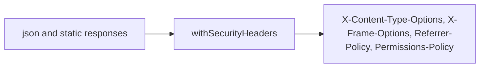
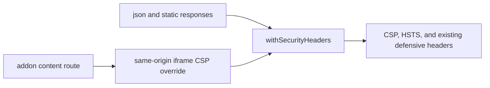

# PR 6 - Browser Session Headers

Branch: `security/browser-session-headers`

## Source Findings

Source: `C:/Users/ronal/OneDrive/Downloads/security_report.pdf`

- Page 11, `[DAST-M3] Missing Content-Security-Policy and HSTS headers`: `withSecurityHeaders` set `X-Content-Type-Options`, `X-Frame-Options`, `Referrer-Policy`, and `Permissions-Policy`, but CSP and HSTS were absent.

## Design

This change adds missing browser-level defenses at the existing centralized response header helper.

- Adds a default Content-Security-Policy for API JSON and static web assets.
- Adds `Strict-Transport-Security: max-age=31536000`.
- Preserves the existing `withSecurityHeaders(headers)` override model for routes with special needs.
- Keeps `style-src 'self' 'unsafe-inline'` because the React UI uses dynamic inline style properties for progress bars, maps, and spacing.
- Keeps `frame-src 'self'` for the existing same-origin addon iframe workflow.
- Serves addon HTML with a per-response script nonce so same-origin UI addons that include inline startup code can run without adding `script-src 'unsafe-inline'`.

## Compatibility Finding

During WebUI validation, the `eda-exchange-bot` addon loaded its static HTML but did not render its exchange dropdown or seed preview. The root cause was this PR's embeddable CSP: `script-src 'self'` allowed the external bridge helper but blocked the addon's inline startup script.

Resolution:

- Keep the default admin-console CSP unchanged with `frame-ancestors 'none'`.
- Keep addon content embeddable only by the same origin with `frame-ancestors 'self'` and `X-Frame-Options: SAMEORIGIN`.
- Add a random nonce to each served addon HTML response and rewrite addon `<script>` tags that do not already declare a nonce.
- Allow only that nonce in the addon HTML `script-src`; do not add `script-src 'unsafe-inline'`.

## Architecture

Before:

After:

## Evidence

Code evidence:

- `console/api/src/auth.js:5-17` defines the default CSP.
- `console/api/src/auth.js:19` defines the same-origin frame override used by addon content.
- `console/api/src/auth.js:21-28` adds CSP and HSTS to the shared security headers.
- `console/api/src/auth.js:30-32` preserves per-route header overrides.
- `console/api/src/addonContentSecurity.js` derives the addon HTML CSP from the same-origin embeddable policy and adds only nonce-backed inline script support.
- `console/api/src/server.js` serves addon HTML with a random script nonce while keeping non-HTML addon assets on the regular embeddable CSP.

Test evidence:

- `console/api/test/auth.test.js:44-54` verifies JSON responses include CSP, HSTS, and the existing defensive headers.
- `console/api/test/auth.test.js:56-64` verifies the explicit same-origin addon frame override.
- `console/api/test/addonContentSecurity.test.js` verifies nonce injection and confirms addon script CSP does not allow `script-src 'unsafe-inline'`.
- `cd console/api && node --test test/auth.test.js test/addonContentSecurity.test.js` - expected local focused gate.

## Minimal Impact

- No authentication flow, session cookie format, API route shape, or UI state changed.
- The change is centralized in the existing `withSecurityHeaders` helper.
- Addon content keeps the existing same-origin iframe behavior while still receiving CSP and HSTS.
- The CSP avoids `unsafe-inline` for scripts and allows it only for styles to preserve current React rendering.

## Follow-Ups

- If dynamic inline styles are refactored into classes or CSS variables without style attributes, remove `style-src 'unsafe-inline'`.
- If addon content gets a signed/provenance model, consider a separate tighter CSP for untrusted addon UI bundles.
