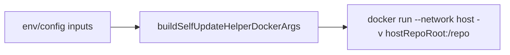
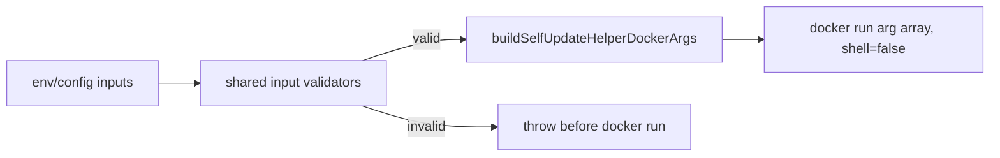

# PR 9 - Console Restart Validation

Branch: `security/console-restart-validation`

## Source Findings

Source: `C:/Users/ronal/OneDrive/Downloads/security_report.pdf`

- Page 9, `[DAST-H5] Self-restart helper launches a privileged docker run with host-controlled paths`: the web self-update helper starts a detached Docker container with host networking, the Docker socket, and a host repo bind mount. The report called out `hostRepoRoot` and `composeProjectName` as environment-controlled inputs that needed validation before helper launch.

## Design

This change validates the inputs used to assemble the detached web self-update helper container.

- Host repo root must be an absolute Linux path and cannot contain whitespace, traversal, shell metacharacters, backslashes, colons, or control characters.
- Compose project name must be an alphanumeric name with `_` or `-`.
- Helper container name must match Docker-style name characters.
- Helper image reference cannot be empty, start with `-`, contain control characters, whitespace, or shell metacharacters.
- Both the self-update task helper and the Web Console port-change restart helper use the same validated Docker argument builder.
- The existing Docker spawn calls still use `shell: false` and argument arrays.

## Architecture

Before:

After:

## Evidence

Code evidence:

- `console/api/src/tasks.js:87-110` resolves the helper inputs and passes them through `buildSelfUpdateHelperDockerArgs`.
- `console/api/src/server.js:9` imports the same validated helper builder for Web Console port-change restarts.
- `console/api/src/server.js:805-833` routes the port-change restart helper through validated Docker args.
- `console/api/src/tasks.js:140-161` validates helper inputs before building Docker args.
- `console/api/src/tasks.js:164-168` validates host repo root paths.
- `console/api/src/tasks.js:171-180` validates Compose project and helper container names.
- `console/api/src/tasks.js:183-188` validates helper image references.
- `console/api/src/tasks.js:191-200` validates extra helper environment variables such as `ADMIN_BIND_PORT`.

Test evidence:

- `console/api/test/tasks.test.js:59-74` verifies the valid host repo mount and environment forwarding.
- `console/api/test/tasks.test.js:76-92` verifies unsafe helper names, paths, project names, image refs, and extra env vars are rejected.
- `cd console/api && node --test test/tasks.test.js` - 5 passing tests.

## Minimal Impact

- No restart/update command flow changed for valid deployments.
- The helper still runs detached and writes to the same update log.
- Existing default values continue to pass validation.
- The change rejects unusual repo paths with spaces or shell metacharacters. Operators using such paths should set `DUNE_HOST_REPO_ROOT` to a safe absolute path.

## Follow-Ups

- Consider replacing the privileged Docker helper with a host-side systemd or supervisor action in a larger architecture change.
- Revisit Docker socket exposure in the container-hardening branch.
