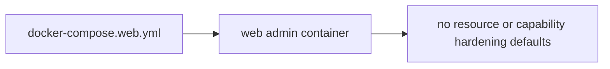
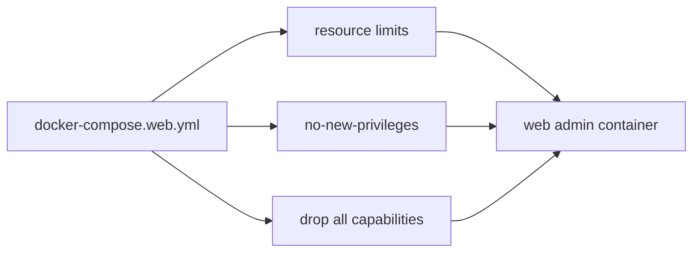

# PR 10 - Container Hardening Defaults

Branch: `security/container-hardening-defaults`

## Source Findings

Source: `C:/Users/ronal/OneDrive/Downloads/security_report.pdf`

- Page 11, `[SAST-M4] No container resource limits / no-new-privileges / capability drops`: Compose services lacked `mem_limit`, CPU limits, `security_opt: no-new-privileges:true`, and `cap_drop`.
- Page 11, `[DAST-M1] No container resource limits (CPU/memory/pids) on any service`: compose files and `start-*.sh` scripts launched containers without memory or CPU controls, increasing resource exhaustion risk.

## Design

This PR applies low-risk hardening defaults to the web admin container only.

- Adds a default `512m` memory limit.
- Adds a default `1.0` CPU limit.
- Adds a default `256` PID limit.
- Adds `security_opt: no-new-privileges:true`.
- Adds `cap_drop: [ALL]`.
- Exposes the resource limits as `.env.example` knobs for operators.

Game-service containers are intentionally left unchanged in this small PR because safe memory and CPU defaults require workload sizing.

## Architecture

Before:

After:

## Evidence

Code evidence:

- `docker-compose.web.yml:11-17` adds memory, CPU, PID, no-new-privileges, and capability-drop defaults.
- `.env.example:58-60` documents operator overrides for the web admin container limits.

Verification evidence:

- `docker compose -f docker-compose.web.yml config` renders:
  - `cap_drop:`
  - `cpus: 1`
  - `mem_limit: "536870912"`
  - `pids_limit: 256`
  - `no-new-privileges:true`

## Minimal Impact

- No application code, API routes, or runtime scripts changed.
- The Docker socket mount remains because the current web admin architecture depends on it.
- Operators can raise or lower resource limits with environment variables.
- Game containers remain untouched to avoid undersizing production worlds.

## Follow-Ups

- Add measured resource limits for Postgres, RabbitMQ, and game services after collecting normal and peak usage.
- Consider a larger architecture change that removes the Docker socket mount from the web admin container.
