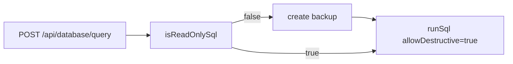
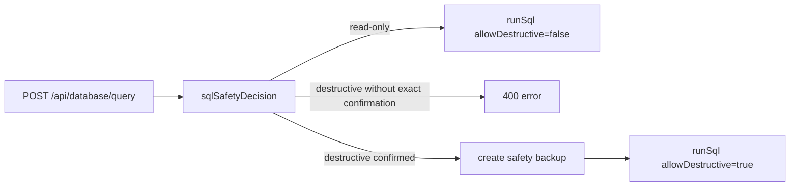

# PR 8 - Destructive SQL Guardrails

Branch: `security/destructive-sql-guardrails`

## Source Findings

Source: `C:/Users/ronal/OneDrive/Downloads/security_report.pdf`

- Page 8, `[DAST-H3] Authenticated arbitrary SQL execution endpoint (read AND write/DDL)`: `POST /api/database/query` forwarded raw SQL to `duneDb.runSql(db, query, true)`, so the read-only check only triggered a backup and did not block writes, DDL, or destructive statements.

## Design

This change keeps the advanced SQL console usable for read-only inspection while requiring explicit per-request confirmation for destructive SQL.

- Empty SQL is rejected before any guardrail decision.
- Read-only SQL continues to execute normally.
- Non-read-only SQL now requires `allowDestructive=true` and the exact confirmation phrase `RUN DESTRUCTIVE SQL`.
- Automatic safety backup behavior is preserved after destructive SQL is confirmed.
- The addon bridge is left unchanged because it already separates `database.query` from `database.execute` and requires approved `database:write` permission for write SQL.

## Architecture

Before:

After:

## Evidence

Code evidence:

- `console/api/src/sqlGuardrails.js:3-13` defines the confirmation phrase and decision object.
- `console/api/src/server.js:29` imports the guardrail helper.
- `console/api/src/server.js:682-689` rejects empty SQL and unconfirmed destructive SQL.
- `console/api/src/server.js:690-694` preserves backups and only passes `allowDestructive` when confirmed.
- Existing addon bridge behavior remains permission-gated at `console/api/src/server.js:457-467`.

Test evidence:

- `console/api/test/sqlGuardrails.test.js:5-27` verifies read-only allowance and exact destructive confirmation.
- `console/api/test/db.test.js:33-39` verifies `runSql` rejects destructive SQL unless explicitly allowed.
- `cd console/api && node --test test/sqlGuardrails.test.js test/db.test.js` - 45 passing tests.

## Minimal Impact

- Read-only database browsing and export workflows are unchanged.
- Destructive SQL is still technically available for deliberate API callers, but no longer runs by accident from the generic query endpoint.
- Automatic pre-write backup remains in place for confirmed destructive SQL.
- No database schema, container, or UI asset changes are included in this PR.

## Follow-Ups

- Consider a small UI prompt for the advanced SQL console if upstream wants browser-based destructive SQL to remain ergonomic.
- Pair this with the later password-policy and addon-provenance PRs for defense in depth.
