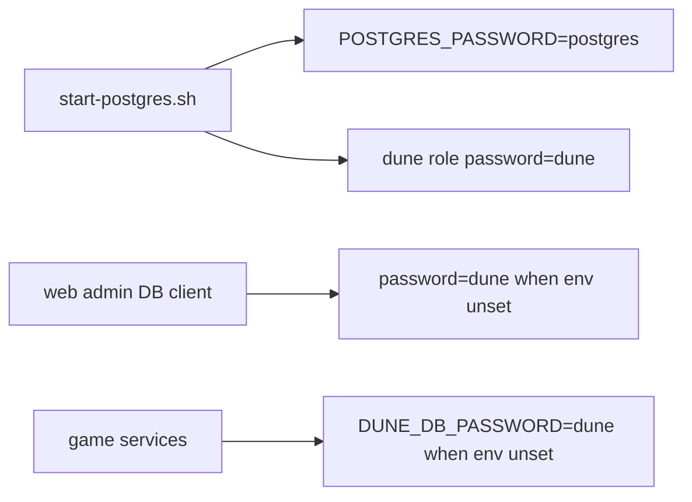
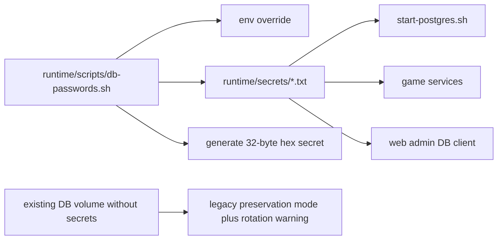

# PR 7 - Generated Database Passwords

Branch: `security/generated-db-passwords`

## Source Findings

Source: `C:/Users/ronal/OneDrive/Downloads/security_report.pdf`

- Page 8, `[DAST-H2] Postgres ships with hardcoded default superuser and dune passwords`: Postgres used `postgres/postgres`, the application role used `dune/dune`, and the web admin defaulted to `password=dune`.
- Page 11, `[SAST-M5] Default low-entropy database credentials`: static `dune/dune` and `postgres/postgres` were mitigated by loopback binding, but still needed generated credentials.

## Design

This change makes new database deployments generate local secret files instead of using static passwords.

- `runtime/secrets/postgres-password.txt` stores the Postgres superuser password.
- `runtime/secrets/dune-db-password.txt` stores the application `dune` role password.
- Runtime scripts prefer explicit environment overrides, then existing secret files, then generate a 32-byte hex password.
- Existing Postgres Docker volumes without secret files are preserved by writing the old legacy values into the new secret files, avoiding a surprise lockout. The script prints a rotation reminder for those installs.
- The web admin DB client reads the same `runtime/secrets/dune-db-password.txt` and no longer silently falls back to `dune`.

## Architecture

Before:

After:

## Evidence

Code evidence:

- `runtime/scripts/db-passwords.sh:3-24` implements env override, existing file reuse, generation, permissions, and newline stripping.
- `runtime/scripts/db-passwords.sh:27-33` defines separate `dune` and `postgres` secret resolvers.
- `runtime/scripts/start-postgres.sh:18-30` detects existing volumes without generated secrets and resolves both passwords.
- `runtime/scripts/start-postgres.sh:54-64` passes the generated Postgres password to the container.
- `runtime/scripts/start-postgres.sh:88-149` uses the generated Postgres password for maintenance `psql` commands.
- `runtime/scripts/start-director.sh:13` and `runtime/scripts/start-director.sh:48` wire the shared resolver into the director.
- `runtime/scripts/start-text-router.sh:13` and `runtime/scripts/start-text-router.sh:37` wire the shared resolver into the text router.
- `runtime/scripts/start-server-gateway.sh:13` and `runtime/scripts/start-server-gateway.sh:44` wire the shared resolver into the gateway.
- `runtime/scripts/db-manager.sh:6-10` uses the shared secret resolver for local database operations.
- `console/api/src/db.js:8-21` discovers DB config from env or generated secret without falling back to `dune`.
- `console/api/src/db.js:73-80` reads `runtime/secrets/dune-db-password.txt`.
- `console/api/src/duneDb.js:42-45` reports default-password status from the discovered credential state.
- `.env.example:59-66` documents the generated secret file default.

Test evidence:

- `runtime/tests/test-db-passwords.sh:14-30` verifies generation, persistence, env override, and legacy preservation mode.
- `console/api/test/db.test.js:9-35` verifies no static fallback, generated secret discovery, and env override precedence.
- `bash runtime/tests/test-db-passwords.sh` - passed.
- `bash -n runtime/scripts/db-passwords.sh runtime/scripts/start-postgres.sh runtime/scripts/start-director.sh runtime/scripts/start-text-router.sh runtime/scripts/start-server-gateway.sh runtime/scripts/db-manager.sh` - passed.
- `cd console/api && node --test test/db.test.js` - 42 passing tests.

## Minimal Impact

- Existing operators can keep using `DUNE_DB_PASSWORD`, `PGPASSWORD`, or `ADMIN_DATABASE_URL`.
- Existing Postgres volumes without generated secrets keep their old credentials and receive an explicit rotation reminder.
- New installs receive generated local secrets without changing Docker networking or database names.
- Secret files are created under the existing `runtime/secrets` directory with `0600` best-effort permissions.

## Follow-Ups

- Prefer updating the web password-rotation workflow to write `runtime/secrets/dune-db-password.txt` directly instead of persisting a DB password in `.env`.
- Raise the database password minimum length in the later password-policy branch for `[DAST-L4]`.
- Add an operator migration note once the branch series is ready for upstream PR submission.
