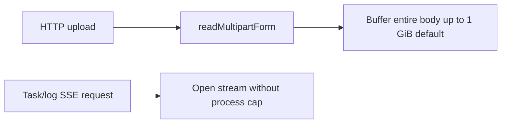
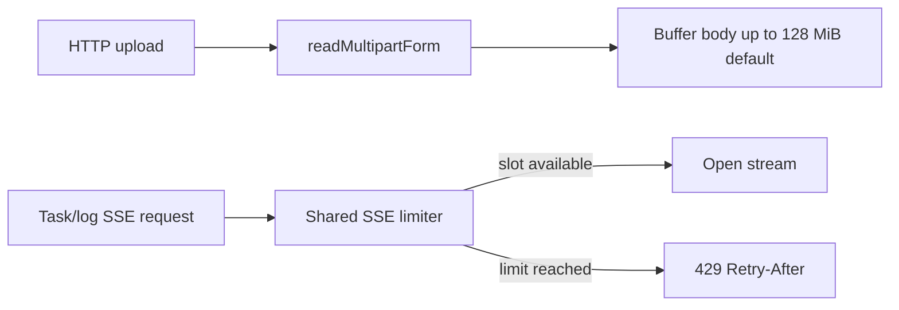

# PR 5 - HTTP DoS Limits

Branch: `security/http-dos-limits`

## Source Findings

Source: `C:/Users/ronal/OneDrive/Downloads/security_report.pdf`

- Page 11, `[DAST-M2] Very large request limits enable memory-pressure DoS`: `ADMIN_MAX_UPLOAD_BYTES` defaulted to 1 GiB while multipart uploads are buffered in memory.
- Page 11, `[DAST-M4] SSE log/task streams have no per-connection cap`: `/api/logs/:svc/stream` and `/api/setup/tasks/:id/stream` had no cap in the single-process server.
- Page 12, `[DAST-M6] usersettings write paths have excessive command timeout`: intentionally left for a separate branch because it needs route-specific command execution changes.

## Design

This change reduces HTTP resource exhaustion risk without changing the web UI workflow.

- Uploads now default to `128 MiB` through `ADMIN_MAX_UPLOAD_BYTES`.
- Live task and log streams now share an in-process SSE connection limiter, defaulting to `20` concurrent streams through `ADMIN_MAX_SSE_CONNECTIONS`.
- Existing environment override behavior is preserved for larger deployments.
- The limiter returns HTTP `429` with `Retry-After: 30` when all stream slots are in use.

## Architecture

Before:

After:

## Evidence

Code evidence:

- `console/api/src/config.js:7` defines the 128 MiB upload default.
- `console/api/src/config.js:38-39` reads `ADMIN_MAX_UPLOAD_BYTES` and `ADMIN_MAX_SSE_CONNECTIONS`.
- `console/api/src/httpSafety.js:71-87` implements the reusable connection limiter.
- `console/api/src/server.js:33` creates the shared SSE limiter from config.
- `console/api/src/server.js:1517-1521` gates task streams through `openSseStream`.
- `console/api/src/server.js:1544-1546` gates log streams through `openSseStream`.
- `console/api/src/server.js:1569-1578` enforces the shared cap and returns `429` on exhaustion.
- `docker-compose.web.yml:28-29` wires the defaults into the web container.
- `.env.example:52-53` documents the operator-facing knobs.

Test evidence:

- `cd console/api && node --test test/config.test.js test/httpSafety.test.js` - 5 passing tests.
- `cd console/api && npm test` - 145 passing tests.
- `docker compose -f docker-compose.web.yml config` shows `ADMIN_MAX_UPLOAD_BYTES: "134217728"` and `ADMIN_MAX_SSE_CONNECTIONS: "20"`.

## Minimal Impact

- No UI routes or request shapes changed.
- No persistent storage or Docker service topology changed.
- Existing operators can still raise or lower both limits with environment variables.
- The limiter is process-local, which matches the current single-process Node admin server.

## Follow-Ups

- Address `[DAST-M6]` in a later branch with route-specific command timeout controls.
- Consider proxy-level request and connection limits for deployments that expose the admin console behind a reverse proxy.
- If the admin server becomes multi-process, move connection accounting to a shared coordination layer.
