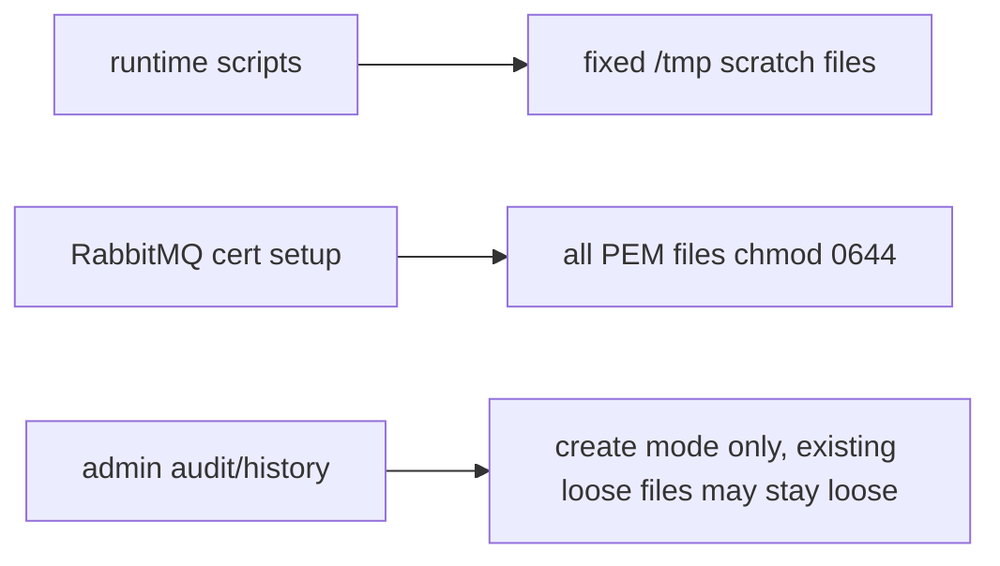
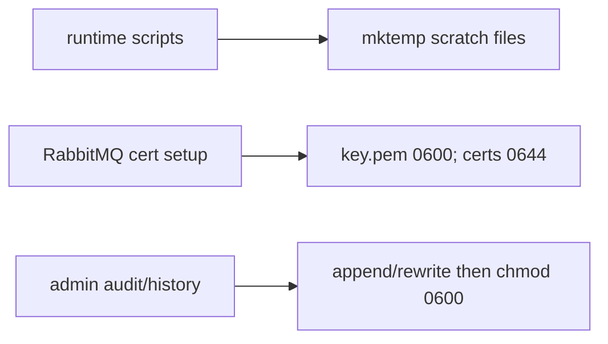

# PR 13 - Runtime File Hygiene Rollup

Branch: `security/hygiene-rollup`

## Source Findings

Source: `C:/Users/ronal/OneDrive/Downloads/security_report.pdf`

- Page 12, `[SAST-L1] World-readable TLS private key`: RabbitMQ TLS key material was chmodded with the same world-readable mode as public certificates.
- Page 12, `[SAST-L2] Predictable shared /tmp filenames`: selected runtime scripts used fixed names under `/tmp` for scratch data.
- Page 12, `[DAST-L3] Audit log and admin command history written with weak permissions`: generated admin audit/history files can contain operator actions and player identifiers and should be private at rest.

## Design

This branch groups small local-file hygiene fixes that do not change network behavior, authentication, container topology, or admin workflows.

- Keeps public RabbitMQ certificate material readable while setting `key.pem` to `0600`.
- Replaces predictable scratch files with `mktemp` in the autoscaler travel path, Steam update check, version manifest read, and database backup/restore container paths.
- Tightens existing API audit/history files to `0600` after append, not only when files are first created.
- Ensures clear-history rewrites and CLI admin audit writes also leave the history/audit files at `0600`.
- Adds a small runtime smoke test to verify the script hardening patterns without starting Docker services.

## Architecture

Before:

After:

## Evidence

Code evidence:

- `runtime/scripts/start-rabbitmq.sh:69-71` separates private key permissions from public certificate permissions.
- `runtime/scripts/autoscaler.sh:911-993` uses a per-run `mktemp` progress file and passes the path into Python snippets through `PROGRESS_JSON`.
- `runtime/scripts/update.sh:340-346` creates Steam app-info scratch output with `mktemp` and cleans it with a trap.
- `runtime/scripts/version.sh:56-72` reads app manifest data through a `mktemp` file and cleans it on every path.
- `runtime/scripts/db.sh:430-442` and `runtime/scripts/db.sh:1088-1106` create database backup/restore scratch paths with container-local `mktemp`.
- `console/api/src/audit.js:1-45` chmods audit/history files to `0600` after appends, including pre-existing files.
- `console/api/src/server.js:553-570` rewrites clear-history files with `0600`.
- `runtime/scripts/admin-tools.sh:75-99` chmods CLI admin history/audit files after writing.

Test evidence:

- `console/api/test/audit.test.js:47-65` verifies loose existing audit/history files are tightened to `0600`.
- `runtime/tests/test-file-hygiene.sh:1-37` verifies the runtime script hardening patterns.
- `bash -n runtime/scripts/start-rabbitmq.sh runtime/scripts/admin-tools.sh runtime/scripts/autoscaler.sh runtime/scripts/update.sh runtime/scripts/version.sh runtime/scripts/db.sh runtime/tests/test-file-hygiene.sh` - passed.
- `bash runtime/tests/test-file-hygiene.sh` - passed.
- `cd console/api && node --test test/audit.test.js` - 3 passing tests.
- `cd console/api && npm test` - 144 passing tests.

## Minimal Impact

- No service names, ports, environment variables, or compose topology changed.
- No admin command payloads, audit schema, or history format changed.
- Existing audit/history files remain in place; their mode is tightened during the next API or CLI write.
- Scratch paths stay under `/tmp`, but are no longer predictable fixed filenames.

## Follow-Ups

- Verify Docker CLI and Compose downloads with checksums or signatures in a separate supply-chain PR.
- Replace `curl https://get.docker.com | sh` installer guidance with a pinned package-repository flow in a separate installer PR.
- Pin mutable development image tags and base images to digests after confirming maintainer preference for digest churn.
