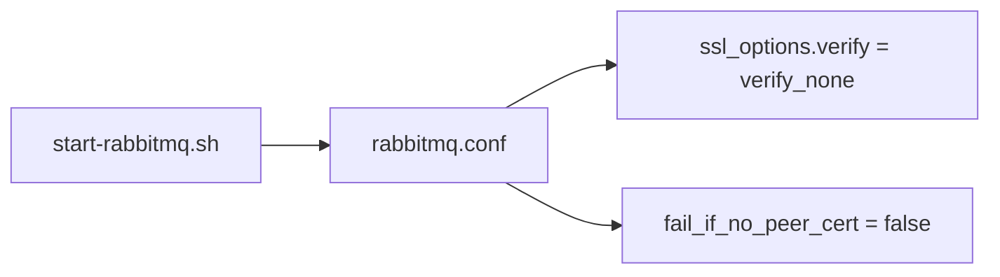
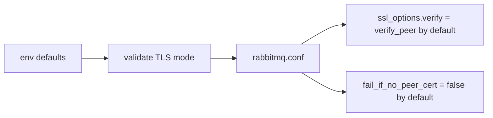

# PR 11 - RabbitMQ TLS Verification Mode

Branch: `security/rmq-tls-verification-mode`

## Source Findings

Source: `C:/Users/ronal/OneDrive/Downloads/security_report.pdf`

- Page 7, `[SAST-H4] RabbitMQ TLS configured with verify_none (no peer/cert verification)`: game RabbitMQ used `ssl_options.verify = verify_none` and `fail_if_no_peer_cert = false`.
- Page 10, `[DAST-H6] Game RabbitMQ TLS uses a self-signed cert with peer verification disabled`: AMQPS was exposed for remote game servers while clients could not validate broker identity.

## Design

This change makes the RabbitMQ game broker TLS verification mode explicit and validated.

- Defaults `RMQ_GAME_TLS_VERIFY` to `verify_peer`.
- Keeps `RMQ_GAME_TLS_FAIL_IF_NO_PEER_CERT=false` by default so existing non-mTLS game clients are not locked out.
- Allows operators to set `verify_none` only through an explicit environment override.
- Validates both TLS mode knobs before writing `rabbitmq.conf`.
- Documents both knobs in `.env.example`.

This does not by itself solve broker identity verification for remote clients. Full MITM resistance still requires managed CA or pinned trust configuration on the clients that connect to AMQPS.

## Architecture

Before:

After:

## Evidence

Code evidence:

- `runtime/scripts/start-rabbitmq.sh:14-15` defines operator-facing defaults.
- `runtime/scripts/start-rabbitmq.sh:17-31` validates accepted values.
- `runtime/scripts/start-rabbitmq.sh:53-61` writes the selected mode into `rabbitmq.conf`.
- `.env.example:70-71` documents the TLS mode knobs.

Test evidence:

- `runtime/tests/test-rmq-tls-mode.sh:61-67` verifies default and override config generation.
- `runtime/tests/test-rmq-tls-mode.sh:69-73` verifies invalid modes fail closed.
- `bash runtime/tests/test-rmq-tls-mode.sh` - passed.
- `bash -n runtime/scripts/start-rabbitmq.sh runtime/tests/test-rmq-tls-mode.sh` - passed.

## Minimal Impact

- Existing deployments without client certificates continue to work because `fail_if_no_peer_cert` remains `false`.
- Operators can temporarily restore `verify_none` through an explicit override if needed.
- No Docker networking, ports, auth backend, or certificate file layout changed.

## Follow-Ups

- Add documented managed-CA or pinned-CA setup for remote game servers.
- Consider an mTLS mode with `RMQ_GAME_TLS_FAIL_IF_NO_PEER_CERT=true` once client certificate distribution is documented.
- Pair this with the RabbitMQ management loopback PR to keep broker admin surfaces local.
